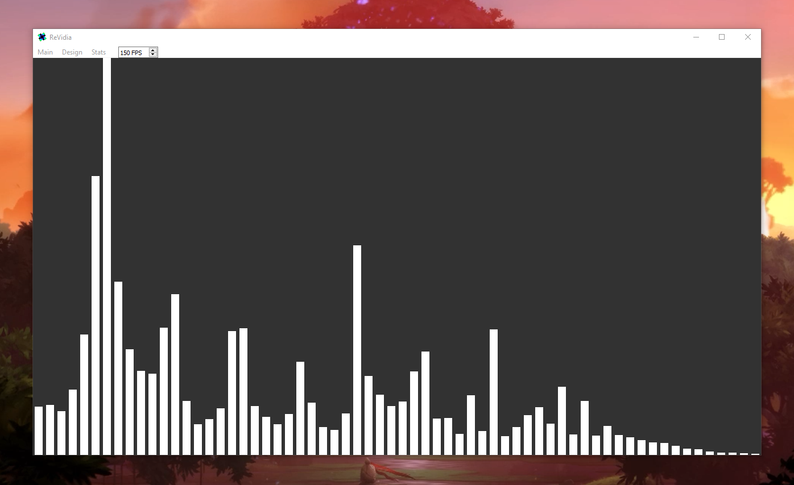

# ReVidia Audio Visualizer [Windows Branch]
### A highly customizable real time audio visualizer on Linux/Windows
#### Branches:
- Linux: master branch
- Windows: win-port branch 
## Requirements
#### Windows: Python 3.8 with PATHS
- Download Python here: https://www.python.org/downloads/
- During installation **MAKE SURE** you check the box: "Add Python to PATH"

#### Highly recommend installing VB-CABLE for Windows (See Below in Important Notes)

## Installation
#### On Windows run:
```
install.bat
```
#### Once Started:
- It might take a couple of minutes, wait until it says "Done"
- Then use the desktop shortcut created to enjoy! 🎉
#### Note: Run the installer again if you move the file at all

## Important Notes:
#### This program ONLY accepts input(mics) audio streams for now 
If you are using **Windows** I HIGHLY recommend installing VB-CABLE:
- https://www.vb-audio.com/Cable/index.htm#DownloadCable  
- Not only will it allow you to use your speaker's audio easily
- But depending on your system, it not might even run properly without the APIs it provides
- To use VB-CABLE follow the guide in the "WindowsReadme.txt"
  
## Future Ideas:
#### In order of importance:
- Add a option to scale the frequencies
- Include a gradient setting
- Make a profile/config feature
- Implement a loop back to speakers on Linux/Windows
- General optimizing
- Fix how transparency is done on Windows
- Overhaul the old Linux terminal version

## Acknowledgments
- Numpy mostly for the FFT
- PyAudio and PortAudio for audio data collection
- PyQt5 and QT for the GUI

 ## License
This project is licensed under the GPLv3 License - see the [LICENSE](/LICENSE.txt) file for details

### For more information please look at the real [ReadMe](/WinReadMe.txt) included
